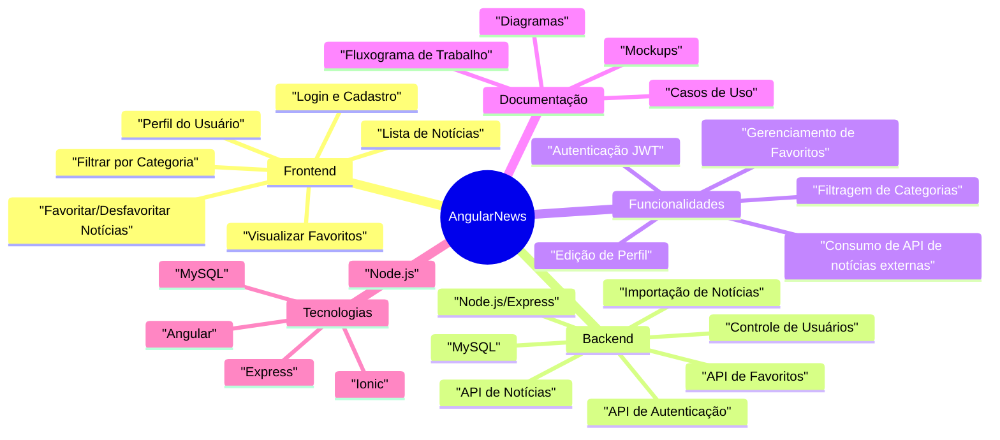
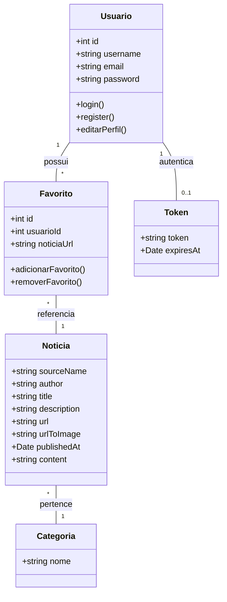
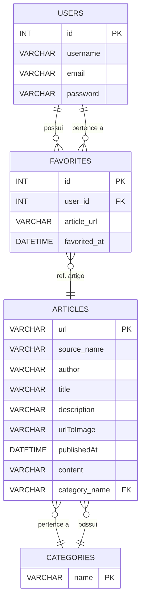

# AngularNews

## Visão Geral

O **AngularNews** é um Web App desenvolvido com Angular (Ionic Framework), focado em fornecer notícias personalizadas ao usuário. O sistema permite cadastro, autenticação, escolha de categorias, favoritos e consumo de notícias em tempo real via APIs públicas, oferecendo uma experiência fluida, responsiva e moderna.

---

## Índice

- [Visão Geral](#visão-geral)
- [Diagramas do Projeto](#diagramas-do-projeto)
- [Como baixar o repositório](#como-baixar-o-repositório)
- [Pré-requisitos](#pré-requisitos)
- [Estrutura de Pastas](#estrutura-de-pastas)
- [Contribuindo](#contribuindo)
- [Documentação](#documentação)
- [Autores](#autores)
- [Licença](#licença)

---

## Diagramas do Projeto

### 1. Mapa Mental do Sistema (Mindmap)


> Veja o arquivo completo em [`angularnewsdocs/Models/mindmap/mindmap.md`](angularnewsdocs/Models/mindmap/mindmap.md)

---

### 2. Diagrama de Classes


> Veja o arquivo completo em [`angularnewsdocs/Models/classes/diagrama_classes.md`](angularnewsdocs/Models/classes/diagrama-de-classes.mermaid)

---

### 3. Diagrama ER (Modelo de Banco de Dados)


> Veja o arquivo completo em [`angularnewsdocs/Models/database/diagrama_bd.md`](angularnewsdocs/Models/database/database.mermaid)

---

## Como baixar o repositório

```bash
git clone https://github.com/SEU_USUARIO/AngularNews.git
cd AngularNews
```

---

## Pré-requisitos

- Node.js (>=18.x)
- Angular CLI (`npm install -g @angular/cli`)
- Ionic CLI (`npm install -g @ionic/cli`)
- MySQL (para o backend)
- (Opcional) Firebase CLI
- Conta no GitHub

---

## Estrutura de Pastas

```
AngularNews/
│
├── angularnewsapi/          # Projeto backend (Node.js/Express)
├── angularnewsapp/          # Projeto frontend (Angular/Ionic)
├── angularnewsdocs/         # Documentação
│   ├── Models/
│   │   ├── classes/         # Diagramas de classes
│   │   ├── database/        # Diagramas de banco de dados
│   │   ├── mindmap/         # Mapa mental do projeto
│   │   └── Mockup/          # Mockups e protótipos de tela
│   ├── Sql/                 # Scripts SQL e modelos de dados
│   └── UseCase/             # Casos de uso, fluxogramas, tutoriais, etc.
├── .gitignore
├── CONTRIBUTING.md
├── LICENSE
├── README.md
└── TODO.md
```

---

## Contribuindo

Primeiro, obrigado por dedicar seu tempo para contribuir com o AngularNews!

### Como contribuir

1. **Faça um fork** do projeto no GitHub.
2. **Clone o seu fork** para sua máquina:
    ```bash
    git clone https://github.com/SEU_USUARIO/AngularNews.git
    cd AngularNews
    ```
3. **Crie uma branch** para sua feature ou correção:
    ```bash
    git checkout -b minha-feature
    ```
4. **Implemente sua contribuição** (código, documentação, testes, etc.).
5. **Faça commit** das alterações:
    ```bash
    git add .
    git commit -m "Descrição clara da alteração"
    ```
6. **Envie sua branch** para seu fork:
    ```bash
    git push origin minha-feature
    ```
7. **Abra um Pull Request** para o repositório principal e aguarde a revisão.

### Enviando Problemas (Issues)

- Crie uma nova issue [aqui](https://github.com/SEU_USUARIO/AngularNews/issues/new/choose) detalhando ao máximo o problema ou sugestão.
- Inclua:
  - Sistema operacional, navegador (caso front-end), versão do Node/Angular/Ionic se relevante.
  - Passos para reproduzir o problema.
  - Comportamento esperado vs. comportamento real.
  - Prints de tela, logs ou outputs do terminal são bem-vindos.
- Antes, verifique se já existe uma issue semelhante aberta ou fechada.

### Enviando Pull Requests

- Certifique-se de que seu código está atualizado com a branch principal (`main`).
- Descreva claramente a proposta de alteração no PR.
- Sempre que possível, relacione a issue resolvida (ex: closes #12).
- Esteja aberto para feedbacks e ajustes solicitados durante a revisão.

### Fluxo de trabalho

Para conhecer o fluxo de trabalho detalhado de colaboração, veja o fluxograma disponível em  
[`angularnewsdocs/UseCase/fluxo_trabalho.md`](angularnewsdocs/UseCase/fluxo_trabalho.md).

### Comandos úteis do Git

```bash
# Clonar o repositório
git clone https://github.com/SEU_USUARIO/AngularNews.git

# Criar uma nova branch
git checkout -b minha-feature

# Verificar status das alterações
git status

# Adicionar arquivos alterados
git add .

# Commitar alterações
git commit -m "Descrição clara da alteração"

# Enviar branch para o fork
git push origin minha-feature

# Atualizar sua branch local com a main do repositório principal
git fetch upstream
git checkout main
git merge upstream/main
```

Mais detalhes estão disponíveis no arquivo [CONTRIBUTING.md](CONTRIBUTING.md).

---

## Documentação

- [Mapa Mental](angularnewsdocs/Models/mindmap/mindmap.md)
- [Diagramas de Classes](angularnewsdocs/Models/classes/diagrama-de-classes.mermaid)
- [Modelo de Banco de Dados](angularnewsdocs/Models/database/database.mermaid)
- [Casos de Uso](angularnewsdocs/UseCase/Casos_de_Uso_AngularNews.md)
- [Fluxograma de Trabalho](angularnewsdocs/UseCase/fluxo_trabalho.md)
- [Casos de uso](angularnewsdocs/UseCase/casos-de-uso.pdf)

---

## Autores

- [Seu Nome](https://github.com/SEU_USUARIO)
- [Colaboradores](#)

---

## Licença

Este projeto está licenciado sob a [Creative Commons BY 4.0](LICENSE).

---
