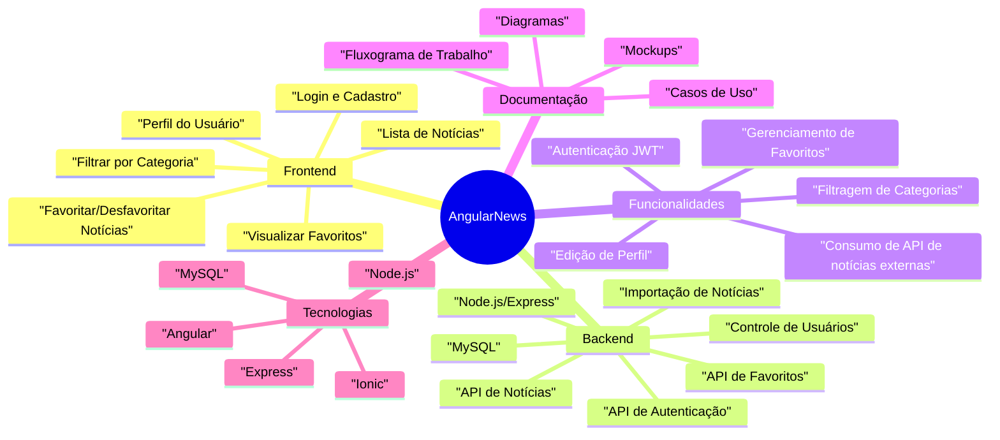

```mermaid
mindmap
  root((AngularNews))
    Frontend
      "Login e Cadastro"
      "Lista de Notícias"
      "Filtrar por Categoria"
      "Favoritar/Desfavoritar Notícias"
      "Visualizar Favoritos"
      "Perfil do Usuário"
    Backend
      "Node.js/Express"
      "MySQL"
      "API de Autenticação"
      "API de Notícias"
      "API de Favoritos"
      "Controle de Usuários"
      "Importação de Notícias"
    Funcionalidades
      "Autenticação JWT"
      "Consumo de API de notícias externas"
      "Gerenciamento de Favoritos"
      "Filtragem de Categorias"
      "Edição de Perfil"
    Documentação
      "Casos de Uso"
      "Diagramas"
      "Mockups"
      "Fluxograma de Trabalho"
    Tecnologias
      "Angular"
      "Ionic"
      "Node.js"
      "Express"
      "MySQL"
```
