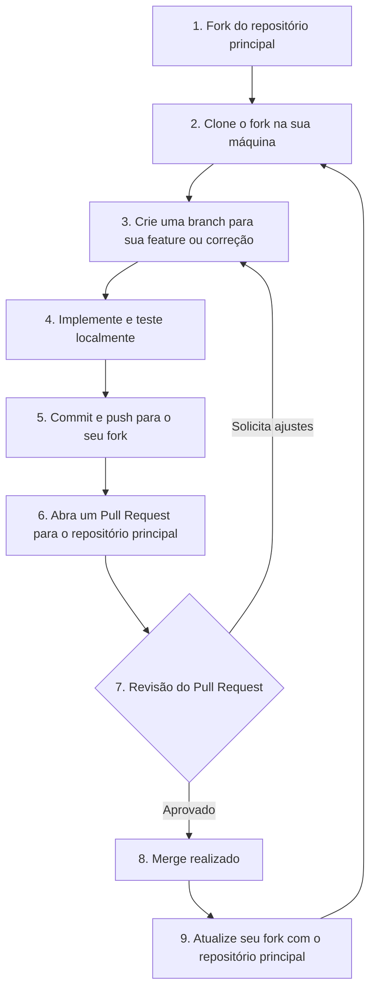

---

### Resumo dos passos

1. Faça um fork do projeto.
2. Clone seu fork para sua máquina.
3. Crie uma branch específica para sua contribuição.
4. Implemente e teste localmente.
5. Faça commit e push para seu fork.
6. Abra um Pull Request para o repositório principal.
7. Aguarde revisão. Se necessário, faça ajustes.
8. Com o PR aprovado, o merge será feito.
9. Lembre-se de manter seu fork atualizado com o principal.

> Dica: Sempre consulte o [CONTRIBUTING.md](../../CONTRIBUTING.md) em caso de dúvidas!
